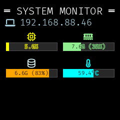

# Stats Monitor for Raspberry Pi Display

This project provides system monitoring stats displayed on a Raspberry Pi with an SPI display using direct SPI communication with ST7789 displays via the Adafruit CircuitPython RGB Display library.

## Display Mode

The project uses **Direct SPI Display** communication which provides:
- Direct hardware communication via SPI
- Support for multiple ST7789 display variants (240x240, 135x240, etc.)
- Configurable display settings
- Better performance and reliability
- No external dependencies

## Quick Start

### Option 1: Docker with Direct SPI (Recommended)

Containerized deployment with direct hardware access:

```bash
./run.sh
```

This provides the benefits of Docker (isolation, auto-restart, easy management) while using direct SPI communication for optimal performance.

### Option 2: Native Direct SPI

Direct hardware communication without Docker:

```bash
./run-local.sh
```

This script will automatically:
- Install system dependencies
- Create a Python virtual environment
- Install required packages
- Test the display
- Start the stats monitor

## Display Configuration

The project supports various ST7789 display configurations through environment variables. You can adjust these settings in the docker-compose.yml file or set them as environment variables for native deployment.

### Configuration Variables

| Variable | Description | Default |
|----------|-------------|---------|
| `SCREEN_WIDTH` | Display width in pixels | 240 |
| `SCREEN_HEIGHT` | Display height in pixels | 240 |
| `DISPLAY_ROTATION` | Display rotation (0, 90, 180, 270) | 180 |
| `DISPLAY_X_OFFSET` | X-axis offset for display alignment | 0 |
| `DISPLAY_Y_OFFSET` | Y-axis offset for display alignment | 70 |
| `TITLE_FONT_SIZE` | Font size for the title text | 20 |
| `STATS_FONT_SIZE` | Font size for the statistics text | 18 |
| `DISPLAY_MODE` | Display mode: `text` or `visual` | text |
| `DISPLAY_LAYOUT` | Layout for visual mode: `rows` or `grid` | rows |

### Display Modes

The project supports two display modes:

**Text Mode (Default):**
- Shows statistics as text with icons
- Format: Icon + Value (e.g., "75.60%", "2.4G/7.6G (32%)")
- Compact and information-dense

**Visual Mode:**
- Shows statistics with progress bars
- Color-coded bars based on warning/critical thresholds
- Simplified labels for memory and disk (total + percentage only)
- More intuitive at-a-glance understanding

### Display Layouts (Visual Mode Only)

**Rows Layout (Default):**
- Statistics displayed in vertical rows
- One stat per row with icon + progress bar + label

**Grid Layout:**
- Statistics displayed in a 2-column grid
- IP address spans full width at top
- CPU/Memory and Disk/Temperature in 2x2 grid
- More compact layout, better use of screen space

To enable visual mode, set `DISPLAY_MODE=visual` in your environment variables or docker-compose.yml.

**Example: Enabling Visual Mode in Docker:**

Edit your `docker-compose.yml` and add the environment variable:

```yml
environment:
  - DISPLAY_MODE=visual
  - SCREEN_WIDTH=240
  - SCREEN_HEIGHT=240
  # ... other settings
```

**Example: Enabling Visual Mode Natively:**

```bash
export DISPLAY_MODE=visual
./run-local.sh
```

**Visual Comparison:**

<table>
<tr>
<td><b>Text Mode (Default)</b></td>
<td><b>Visual Mode</b></td>
</tr>
<tr>
<td>
• Compact text display<br>
• Full usage details<br>
• Higher information density
</td>
<td>
• Progress bars<br>
• At-a-glance understanding<br>
• Color-coded status
</td>
</tr>
</table>

### Pre-configured Display Sizes

The project includes pre-configured docker-compose files for common display sizes:

**240x240 (Default):**
```bash
./run.sh  # Uses docker-compose.yml
```

**1.14" 135x240 Display:**
```bash
sudo docker compose -f docker-compose.1.14inch.yml up -d --build
```

**1.47" 172x320 Display:**
```bash
sudo docker compose -f docker-compose.1.47inch.yml up -d --build
```

**1.9" 170x320 Display:**
```bash
sudo docker compose -f docker-compose.1.9inch.yml up -d --build
```

### Custom Configuration

To use a custom display configuration, modify the environment variables in docker-compose.yml:

```yml
environment:
  - SCREEN_WIDTH=240
  - SCREEN_HEIGHT=320
  - DISPLAY_ROTATION=90
  - DISPLAY_X_OFFSET=0
  - DISPLAY_Y_OFFSET=0
  - TITLE_FONT_SIZE=22
  - STATS_FONT_SIZE=20
```

For native deployment, set environment variables before running:

```bash
export SCREEN_WIDTH=135
export SCREEN_HEIGHT=240
export DISPLAY_ROTATION=90
./run-local.sh
```

## Hardware Requirements

### For Direct SPI Mode:
- Raspberry Pi with SPI enabled
- ST7789 display connected via SPI
- Standard connections:
  - CS: CE0 (GPIO 8)
  - DC: GPIO 25
  - RST: GPIO 24
  - SPI MOSI, SCLK as usual

### SPI Setup:
Enable SPI on your Raspberry Pi:
```bash
sudo raspi-config
# Navigate to Interface Options > SPI > Enable
```

## Project Structure

```
src/
├── stats.py              # Main stats monitor (direct SPI)
├── stats_fallback.py     # Fallback version (saves to files)
├── test_display.py       # Display test utility
├── display_config.py     # Display configuration
├── system_stats.py       # System statistics collection
└── stat_row.py           # UI component for stat rows
```

## Dependencies

### Direct SPI Mode:
- `adafruit-circuitpython-rgb-display` - Display driver
- `adafruit-blinka` - CircuitPython compatibility
- `pillow` - Image processing and rendering
- `psutil` - System statistics
- `humanize` - Human-readable formatting

### HTTP Server Mode:
- All of the above plus `requests` for HTTP communication

## Development

### Testing Display Configuration

Run the test script to verify your display works:

```bash
python src/test_display.py
```

This will show colored screens and test patterns to verify proper display operation.

### Fallback Mode for Development

When developing without hardware, use the fallback mode:

```bash
python src/stats_fallback.py
```

This saves rendered images to `./output/` directory so you can see what would be displayed.

## Docker Support (Direct SPI Mode)

The Docker setup provides direct SPI communication within containers:

### Quick Start with Docker

```bash
# Build and run the SPI container
./run.sh

# Or manually:
sudo docker compose up -d --build
```

### Docker Architecture

- **spi-stats**: Single container with direct SPI hardware access
- **Privileged mode**: Required for GPIO and SPI device access
- **Volume mounts**: Host system stats and hardware devices

### Docker Compose Configuration

```yml
services:
  spi-stats:
    image: ghcr.io/cybermaak/spi-stats:latest
    container_name: spi-stats
    privileged: true
    devices:
      - /dev/mem:/dev/mem
      - /dev/gpiomem:/dev/gpiomem
      - /dev/spidev0.0:/dev/spidev0.0
      - /dev/spidev0.1:/dev/spidev0.1
    volumes:
      - /proc:/host/proc:ro # Mount host's /proc to /host/proc to pull host stats
      - /:/host/disk_root:ro # Mount host's root disk to get host disk stats
    restart: unless-stopped
    network_mode: host
    healthcheck:
      test: [ "CMD", "pgrep", "-f", "python3 /app/src/stats.py" ]
      interval: 30s
      timeout: 10s
      retries: 3
      start_period: 10s
    environment:
      - PROCFS_PATH=/host/proc
      - DISK_ROOT=/host/disk_root
      # Display configuration - adjust for your screen
      - SCREEN_WIDTH=240
      - SCREEN_HEIGHT=240
      - DISPLAY_ROTATION=180
      - DISPLAY_X_OFFSET=0
      - DISPLAY_Y_OFFSET=70
      # Font sizes - adjust for your screen size
      - TITLE_FONT_SIZE=20
      - STATS_FONT_SIZE=18
```

### Docker Commands

```bash
# Build and start (recommended)
./run.sh

# Build only
./build.sh

# Stop service
./stop.sh

# View logs
sudo docker compose logs -f spi-stats
```

### Native Commands

```bash
# Run native SPI version
./run-local.sh

# Test display only
python src/test_display.py

# Manual run (after setup)
python src/stats.py
```

### Why Use Docker SPI Mode?

- **Production deployment**: Containerized service with health checks
- **Isolation**: Application runs in isolated container
- **Automatic restart**: Service restarts automatically on failure
- **Easy management**: Standard Docker tooling
- **Direct hardware access**: Optimal performance
- **Consistent environment**: Same runtime regardless of host setup

## Troubleshooting

### Display Not Working:
1. Verify SPI is enabled: `lsmod | grep spi`
2. Check connections match your `display_config.py`
3. Run `python src/test_display.py` to test basic functionality
4. Try different rotation values (0, 90, 180, 270)

### Permission Issues:
- Ensure your user is in the `spi` and `gpio` groups
- Run with `sudo` if needed for hardware access

### Import Errors:
- Install all requirements: `pip install -r requirements.txt`
- For Raspberry Pi, you may need: `sudo apt install python3-dev`

**Inspiration:** 

I have a KubeSail PiBox which is still a nice Raspberry Pi enclosure, but its ecosystem became obsolete with the retirement of the KubeSail project ([PiBox docs here](https://docs.kubesail.com/pibox/) and this is a [wayback link](https://web.archive.org/web/20250919190846/https://docs.kubesail.com/pibox/) in case the docs also die). 

After reflashing the Pi, I couldn't find a decent out-of-box solution for displaying stats on the enclosure's ST7789 display, hence this project. This implementation uses direct SPI communication for optimal performance and reliability.

This is how the stats look:


